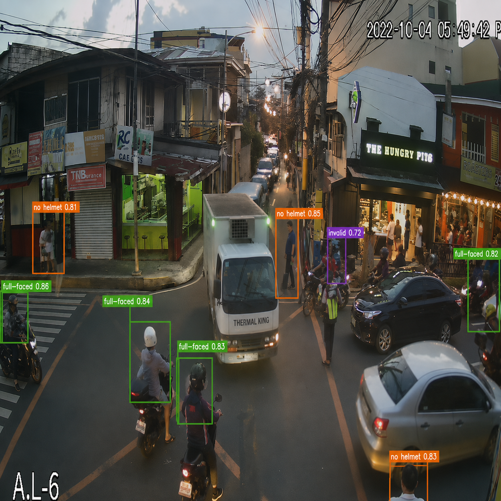

# Motorcycle Detection

A compact PyTorch helmet detection model for four classes: full-faced, half-faced, invalid, and no helmet.

This repository includes training, inference, dataset utilities, and example outputs for a small custom detector.

---

## Demo Output

The repository includes a sample inference result saved in `outputs/results.png`.



> The model draws bounding boxes, class labels, confidence scores, and optional segmentation masks on detected helmets.

---

## Repository Contents

- `train.py` — training loop, dataset loading, checkpoint saving
- `inference.py` — run a single image through the detector and save visual output
- `models/` — network backbone and detector head
- `losses/` — YOLO-style loss and target generation
- `utils/` — dataset utilities, NMS, metrics, visualization helpers
- `dataset/` — train / valid / test folders with images and YOLO labels
- `checkpoints/` — saved model weights
- `outputs/` — inference visualizations

---

## Setup

1. Create a Python virtual environment.

```bash
python -m venv .venv
source .venv/bin/activate
pip install -r requirements.txt
```

2. If you have a CUDA-enabled GPU, install the appropriate PyTorch build from https://pytorch.org. The code will automatically use CUDA when available.

---

## Dataset Format

The project expects a YOLO-style dataset layout:

```
dataset/
  train/
    images/
    labels/
  valid/
    images/
    labels/
  test/
    images/
    labels/
```

Each label file is a plaintext `.txt` with one object per line:

```
<class_id> <cx> <cy> <w> <h>
```

- `class_id` is 0..3
- `cx`, `cy`, `w`, `h` are normalized to [0, 1]

Class mapping:

- `0` — full-faced
- `1` — half-faced
- `2` — invalid
- `3` — no helmet

---

## Training

Run training with default settings:

```bash
python train.py
```

The training script uses `checkpoints/` to save weights and may evaluate on validation data during training.

If you need to adjust training behavior, edit the `CONFIG` dictionary in `train.py`.

---

## Inference

Run inference on a single image:

```bash
python inference.py --image path/to/image.jpg --checkpoint checkpoints/best.pth
```

By default, the script saves the output image to `outputs/<input_filename>`.

Optional flags:

- `--conf` — confidence threshold (default `0.4`)
- `--iou` — IoU threshold for NMS (default `0.45`)
- `--no-masks` — skip segmentation masks for faster rendering

Example:

```bash
python inference.py --image dataset/test/images/example.jpg --checkpoint checkpoints/best.pth --conf 0.5 --iou 0.5
```

---

## Output Files

- Checkpoints are stored in `checkpoints/`.
- Inference visualizations are saved in `outputs/`.
- Example result image: `outputs/results.png`.

---

## Notes

- The model is designed for lightweight helmet detection, with a custom backbone and YOLO-style detection heads.
- `utils/nms.py` performs post-processing and non-maximum suppression.
- `losses/detection_loss.py` computes objectness, classification, and GIoU losses.

---

## CPU / Low-memory Tips

- Use `num_workers=0` in `train.py` for CPU-only systems.
- Lower `batch_size` if available memory is limited.
- Use `torch.set_num_threads(4)` to reduce CPU parallelism.

---

## Quick Start Checklist

1. Prepare `dataset/` with train/valid/test splits.
2. Install dependencies.
3. Run `python train.py`.
4. Run `python inference.py --image dataset/test/images/<file>.jpg --checkpoint checkpoints/best.pth`.
5. Review saved images in `outputs/`.

---

## Want More?

If you want, I can also add:

- a `run.sh` helper script for train/eval/infer,
- a `REPORT.md` template for assignment notes,
- a `CHANGELOG.md` summarizing the project files and outputs.
