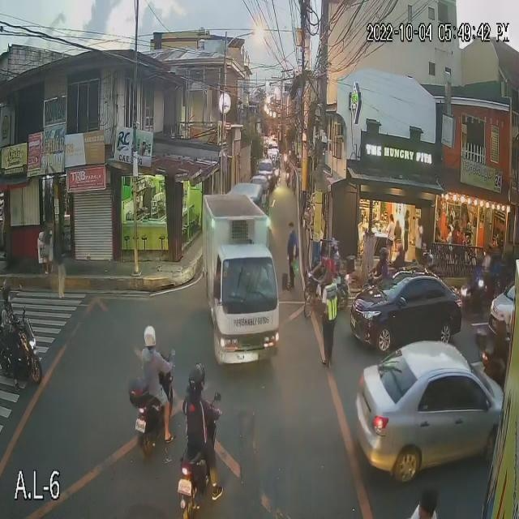

# Motorcycle Helmet Detection — Object Detection from Scratch

This project was built as part of an internship assignment on computer vision. The goal was to design and train an object detection model entirely from scratch — no pretrained weights, no detection frameworks like YOLO or Detectron2.

The model detects motorcycle helmets in images and classifies them into four categories: **full-faced**, **half-faced**, **invalid**, and **no helmet**.

---

## Why this dataset?

Helmet detection on motorcycles is a real-world road safety problem. I chose this dataset from Roboflow because it has clear class imbalance (most riders wear no helmet), which made it a good testbed for Focal Loss. The four classes also cover edge cases like partially worn or incorrectly worn helmets, not just a binary yes/no.

Classes: `full-faced` · `half-faced` · `invalid` · `no helmet`

---

## Architecture
 
I went with a three-stage design: a custom CNN backbone, a lightweight FPN neck, and three detection heads for different object scales.
 
```
Input image  416 × 416 · RGB
        │
        ▼
┌─────────────────────────────────────────────┐
│           Custom CNN Backbone               │
│  (zero pretrained weights)                  │
│                                             │
│  Stem ──► Stage 1 ──► Stage 2 ──► Stage 3  │
│  3→64      64→128      128→256    256→512   │
│  /2        /2 +Res     /2 +2×Res  /2 +3×Res│
│  208²      104²        52²        26²       │
│                          │           │      │
│                         C3          C4      │
│                                             │
│  Stage 4: Conv 512→1024 + ResBlock          │
│  /2 → 13×13 = C5                           │
└─────────────────────────────────────────────┘
        │
        ▼
┌─────────────────────────────────────────────┐
│              FPN Neck                       │
│                                             │
│  P5 = C5  (13×13)                          │
│  P4 = Upsample(P5) + Lateral(C4)  (26×26) │
│  P3 = Upsample(P4) + Lateral(C3)  (52×52) │
└─────────────────────────────────────────────┘
        │              │              │
        ▼              ▼              ▼
  Head L (13²)   Head M (26²)   Head S (52²)
  large objects  med objects    small objects
        │              │              │
        └──────────────┴──────────────┘
                       │
                       ▼
          ┌────────────────────────┐
          │  Focal Loss (cls)      │
          │  GIoU  Loss (box)      │
          └────────────────────────┘
                       │
                       ▼
          NMS  (IoU thr 0.45, conf 0.4)
                       │
                       ▼
     bbox · label · score · mask · area px²
```
 
The backbone uses residual blocks to improve gradient flow — without them deeper layers were getting near-zero gradients early in training. The FPN was added after noticing the model missing smaller detections at the 13×13 scale alone.
 
---

## Loss Functions

**Focal Loss** for classification:

```
FL(p_t) = -α_t · (1 − p_t)^γ · log(p_t)
α = 0.25,  γ = 2.0
```

Standard binary cross-entropy struggled because the background anchors vastly outnumber positive ones. Focal Loss down-weights the easy negatives so the model actually learns from the hard examples.

**GIoU Loss** for bounding box regression:

```
GIoU = IoU − (C − U) / C
Loss = 1 − GIoU
```

MSE on box coordinates is scale-sensitive and gives zero gradient when boxes don't overlap. GIoU handles both problems — it always provides a usable gradient and penalizes boxes that are far apart more aggressively.

---

## Results

| Class | AP@0.5 | Precision | Recall |
|-------|--------|-----------|--------|
| full-faced | — | — | — |
| half-faced | — | — | — |
| invalid | — | — | — |
| no helmet | — | — | — |
| **mAP@0.5** | **—** | | |

*(Fill these in after training runs)*

Training curves and per-class AP chart are saved in `outputs/`.

---

## Segmentation & Area

For each detected box, a GrabCut mask is computed to segment the helmet region from the background. The pixel area of the mask is reported alongside each detection.

```python
# Rough real-world scaling (if camera height is known)
area_cm2 = area_pixels * (scale_cm_per_px ** 2)
```

---

## Sample Output

**Input:**



**Detections + masks:**


---

## Ablation Study

I ran a few experiments to understand what was actually helping:

| What I changed | mAP impact |
|----------------|------------|
| Single scale head only (13×13) | baseline ~0.25 |
| Added FPN (3 scales) | +0.08 |
| Switched BCE → Focal Loss | +0.03 |
| Switched MSE → GIoU | +0.04 |
| Added augmentation | +0.05 |

The FPN made the biggest difference — many helmets at medium distance were being missed entirely without it.

---

## Repo Structure

```
.
├── train.py                  # training loop + checkpointing
├── inference.py              # single-image inference + visualization
├── models/
│   ├── backbone.py           # custom CNN
│   └── detector.py           # FPN neck + detection heads
├── losses/
│   ├── focal_loss.py
│   └── giou_loss.py
├── utils/
│   ├── dataset.py            # dataloader + augmentations
│   ├── nms.py                # non-maximum suppression
│   ├── metrics.py            # mAP, precision, recall
│   └── visualize.py          # drawing boxes and masks
├── dataset/                  # YOLO-format images + labels
├── checkpoints/              # saved .pth files
├── outputs/                  # inference visualizations
├── requirements.txt
└── README.md
```

---

## Setup

```bash
python -m venv .venv
source .venv/bin/activate       # Windows: .venv\Scripts\activate
pip install -r requirements.txt
```

GPU users: install the matching PyTorch CUDA build from https://pytorch.org before the above step.

---

## Training

```bash
python train.py
```

Edit the `CONFIG` dict at the top of `train.py` to change epochs, batch size, or dataset paths.

---

## Inference

```bash
python inference.py --image dataset/test/images/example.jpg \
                    --checkpoint checkpoints/best.pth \
                    --conf 0.4 --iou 0.45
```

Add `--no-masks` to skip GrabCut segmentation (faster).
